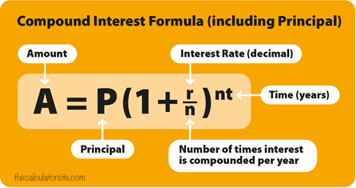

This is project one for the _Java Servlets_ and JSP:

This will use everything we have learned thus far. Create a web application that has a simple page containing a compound interest calculator.

It needs to ask for the necessary inputs to make the calculation:
- Principal Amount(Starting Balance)
- Interest Rate as a percentage
- Time in years

Number of times per year to compound the interest

After the user inputs that information into an HTML form, process the request as a POST request and perform the necessary calculation. After the calculation is complete, forward the resulting calculation back to the JSP page and display it.

I also recommend forwarding the inputs back to the page and putting them back into the input boxes so the user doesn’t need to retype them all. If there are any errors, like they don't provide all the necessary inputs, then forward an error back to the JSP page and display it.

Formula to calculate compound interest:

Here is an example: